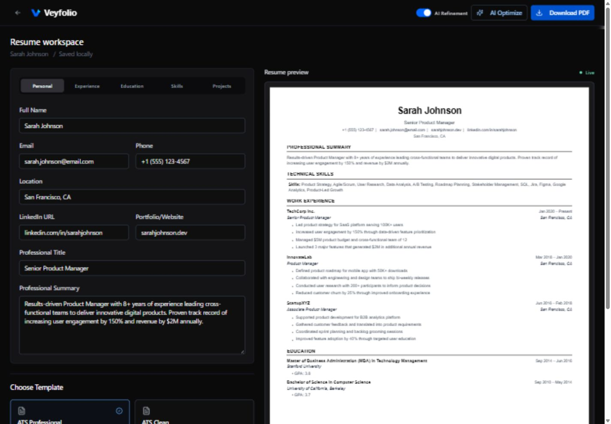
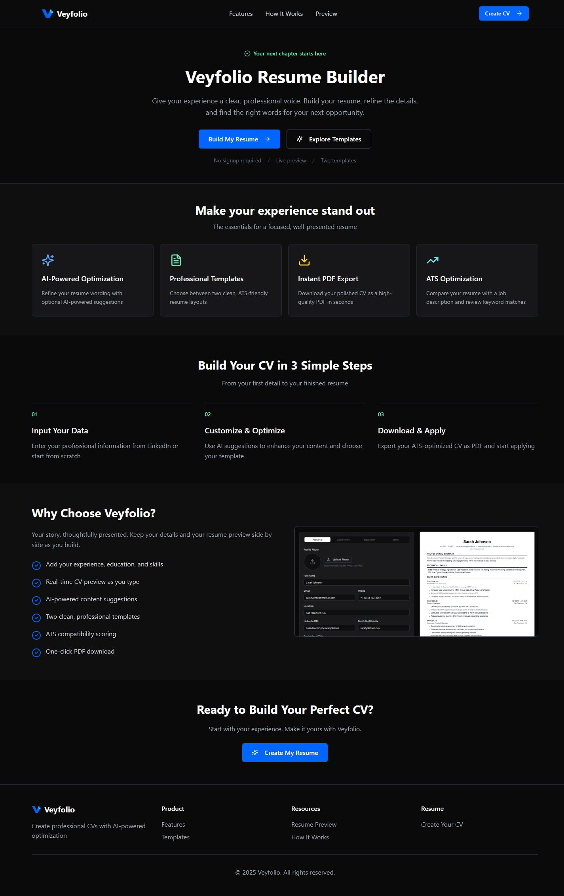
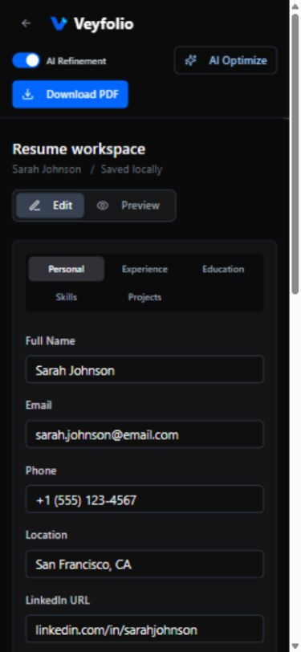

<p align="center">
  
</p>

<h1 align="center">Veyfolio</h1>
<p align="center">A focused resume workspace with live preview and PDF export.</p>
<p align="center">
  <a href="#screenshots">Screenshots</a> &middot;
  <a href="#getting-started">Getting Started</a> &middot;
  <a href="#features">Features</a> &middot;
  <a href="LICENSE">MIT License</a>
</p>

Veyfolio helps you turn your experience, education, skills and projects into a
clear professional resume. Edit your details beside a live preview, choose a
template, and download a PDF. No signup is required for the resume workspace.

Previously named **CVCraft**. Built with React, Tailwind CSS and FastAPI.

## Screenshots

### Resume Workspace



<details>
<summary>Homepage and mobile workspace</summary>



<p align="center">
  
</p>

</details>

Screenshots use fictional sample resume data.

## Features

- **Live preview:** name, professional title, contact details and all resume sections stay connected.
- **Two templates:** ATS Professional and ATS Clean layouts.
- **Projects:** project names, technologies, links and descriptions.
- **Local autosave:** drafts and template choice persist in this browser.
- **PDF export:** browser export, with optional server-side LaTeX compilation.
- **Job keyword checks:** review matched/missing terms against a job description.
- **Optional AI refinement:** wording suggestions when provider credentials are configured.
- **Responsive workspace:** separate editing and preview views on mobile.

Keyword scores are guidance, not a guarantee of passing an employer's ATS.
Local drafts are not cloud backups; clearing browser storage can delete them.

## Tech Stack

| Layer | Technologies |
| --- | --- |
| Frontend | React 18, React Router, Tailwind CSS, Radix UI, jsPDF |
| Backend | Python, FastAPI, Pydantic, HTTPX |
| Services | MongoDB; optional Redis and NVIDIA inference APIs |
| Tests | Jest, fast-check, pytest, Hypothesis |

## Getting Started

### Requirements

- Node.js 20+ and npm; use a supported LTS release.
- Python 3.11 or 3.12.
- MongoDB for database-backed endpoints.
- Optional Redis for shared caching and rate limits.
- Optional `pdflatex` and TeX packages for server PDF compilation.

### Frontend

```bash
git clone https://github.com/KartikSharma4448/Veyfolio.git
cd Veyfolio/frontend
npm ci
```

Copy `frontend/.env.example` to `frontend/.env` and adjust the backend address.

```bash
npm start
```

Open [localhost:3000](http://localhost:3000). Editing, preview, local drafts and
browser PDF export work without AI provider keys. Backend actions need the API.

### Backend

From the repository root:

```bash
cd backend
python -m venv .venv
```

Activate with `.venv\Scripts\Activate.ps1` on PowerShell or
`source .venv/bin/activate` on macOS/Linux, then:

```bash
python -m pip install -r requirements.txt
python -m pip install -r requirements-dev.txt
```

Copy `backend/.env.example` to `backend/.env`, configure MongoDB and start:

```bash
python -m uvicorn server:app --host 127.0.0.1 --port 8000 --reload
```

API documentation: [localhost:8000/docs](http://localhost:8000/docs).
`GET /api/` confirms the API responds, not that MongoDB or providers are connected.

## Configuration

| Variable | Purpose |
| --- | --- |
| `REACT_APP_BACKEND_URL` | Frontend API origin |
| `MONGO_URL`, `DB_NAME` | Backend database configuration |
| `CORS_ORIGINS` | Comma-separated allowed frontend origins |
| `GEMMA_API_KEY` | Optional AI refinement |
| `EMBED_API_KEY`, `RERANK_API_KEY` | Optional semantic matching |
| `REDIS_URL` | Optional shared cache/rate-limit store |
| `REACT_APP_GA4_ID` | Optional analytics; omit to leave tracking disabled |

Never put backend credentials in `REACT_APP_*` variables: frontend values are
public in the built app. Keep real `.env` files out of Git.

## Build and Test

```bash
cd frontend
npm run build
npm test -- --watchAll=false --runInBand
```

```bash
cd backend
python -m pytest tests -v
```

Frontend output: `frontend/build`. AI refinement needs valid provider keys;
keyword scoring has a heuristic fallback. Server PDF compilation needs TeX;
the editor can fall back to browser PDF export.

## Project Layout

```text
backend/                 API routes, templates and Python tests
frontend/src/pages/      Homepage and resume workspace
frontend/src/components/ Preview, template picker and controls
frontend/src/lib/        API client, draft storage and PDF helpers
frontend/public/         Branding and public assets
docs/screenshots/        Current product screenshots
```

## Contributing and Security

See [CONTRIBUTING.md](CONTRIBUTING.md) for development checks and
[SECURITY.md](SECURITY.md) for private vulnerability reporting. Avoid real
personal resume data in examples, screenshots and public issues.

## License

Licensed under the [MIT License](LICENSE). Existing copyright and license
terms are preserved.
